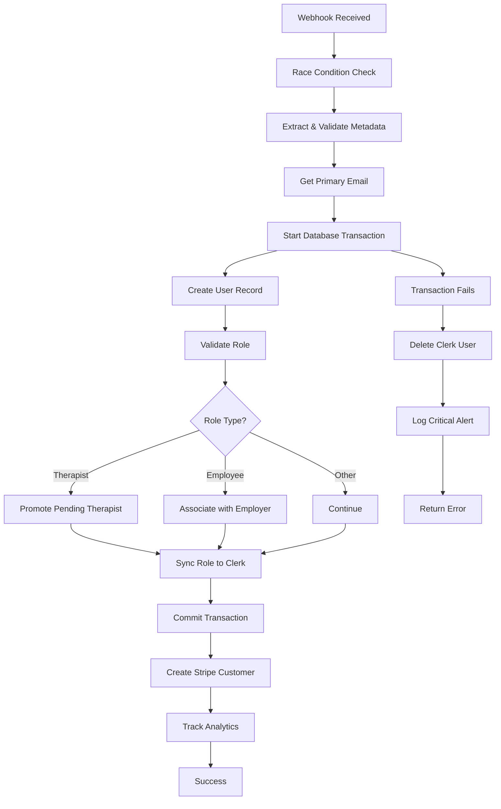

# Clerk Webhook Flows Documentation

## Overview

This document outlines the complete Clerk authentication and user management flows in the Renavest application, including webhook processing, user lifecycle management, and atomic signup patterns.

## 📋 Table of Contents

1. [Architecture Overview](#architecture-overview)
2. [User Signup Flow](#user-signup-flow)
3. [Webhook Processing](#webhook-processing)
4. [User Lifecycle Events](#user-lifecycle-events)
5. [Session Management](#session-management)
6. [Metadata Management](#metadata-management)
7. [Error Handling & Recovery](#error-handling--recovery)
8. [Security & Compliance](#security--compliance)

## 🏗️ Architecture Overview

### Components
- **Clerk**: Authentication provider and user management
- **Next.js Middleware**: Route protection and role-based access
- **Webhook Handlers**: Sync Clerk events to database
- **Database**: PostgreSQL with user, therapist, and session tables
- **Metadata Manager**: Centralized metadata synchronization

### Key Files
```
src/
├── app/api/webhooks/clerk/
│   ├── route.ts                    # Main webhook endpoint
│   ├── handlers.ts                 # Event processing logic
│   ├── userOperations.ts          # User CRUD operations
│   ├── sponsoredGroupHelpers.ts   # Employer association logic
│   └── types.ts                   # TypeScript definitions
├── features/auth/utils/
│   ├── metadataManager.ts         # Centralized metadata management
│   └── signupHelpers.ts           # Client-side signup utilities
├── middleware.ts                  # Route protection
└── shared/types.ts               # Common type definitions
```

## 🔄 User Signup Flow

### Frontend Signup Process

#### 1. **Role Selection & Onboarding**
```typescript
// User selects role and completes onboarding questions
const signupData = {
  role: 'employee' | 'therapist' | 'employer_admin' | 'individual_consumer',
  onboardingData: {
    purpose: string,
    ageRange: string,
    maritalStatus: string,
    ethnicity: string,
  },
  sponsoredGroupName?: string, // For employees
}
```

#### 2. **Clerk User Creation**
```typescript
// OAuth (Google) Flow
await signUp.authenticateWithRedirect({
  strategy: 'oauth_google',
  redirectUrl: '/sso-callback',
  redirectUrlComplete: '/auth-check',
  unsafeMetadata: {
    role: selectedRole,
    onboardingComplete: false,
    purpose: onboardingData.purpose,
    ageRange: onboardingData.ageRange,
    maritalStatus: onboardingData.maritalStatus,
    ethnicity: onboardingData.ethnicity,
    agreeToTerms: true,
    sponsoredGroupName: selectedSponsoredGroup || '',
    signupMethod: 'google_oauth',
    signupTimestamp: new Date().toISOString(),
  },
});

// Email/Password Flow
await signUp.create({
  emailAddress: email,
  password: password,
  firstName: firstName,
  lastName: lastName,
  unsafeMetadata: { /* same as above */ }
});
```

#### 3. **Post-Signup Redirect**
- OAuth: `/sso-callback` → `/auth-check`
- Email: Email verification → `/auth-check`

### Backend Webhook Processing (Atomic Signup)

#### 1. **Webhook Reception**
```typescript
// /api/webhooks/clerk - Main endpoint
POST /api/webhooks/clerk
Headers:
  - svix-id: [event-id]
  - svix-timestamp: [unix-timestamp]
  - svix-signature: [hmac-signature]
Body: WebhookEvent
```

#### 2. **Signature Verification**
```typescript
// Verify webhook authenticity
const wh = new Webhook(WEBHOOK_SECRET);
const evt = wh.verify(body, {
  "svix-id": svixId,
  "svix-timestamp": svixTimestamp,
  "svix-signature": svixSignature,
});
```

#### 3. **Atomic User Creation Process**



#### 4. **Detailed Atomic Process**

```typescript
export async function handleUserCreateOrUpdate(
  eventType: 'user.created' | 'user.updated',
  data: WebhookUserData,
): Promise<Result<boolean, UserHandlingError>> {
  
  // STEP 1: Race Condition Prevention
  if (processingUsers.has(id)) {
    return ok(true); // Skip duplicate processing
  }
  processingUsers.add(id);

  try {
    // STEP 2: Validate Email
    const emailResult = getPrimaryEmail(emailAddresses, id);
    if (emailResult.isErr()) {
      if (eventType === 'user.created') {
        await deleteClerkUserOnFailure(id, 'No valid email found');
      }
      return err(emailResult.error);
    }

    // STEP 3: Database Transaction (ATOMIC)
    const result = await db.transaction(async (tx) => {
      
      // Create or update user
      const finalUser = await createUser({
        clerkId: id,
        email: primaryEmail,
        firstName: data.first_name,
        lastName: data.last_name,
        role: clerkProvidedRole,
      }, tx);

      // Role-specific processing
      if (finalUser.role === 'therapist') {
        await promotePendingTherapist(finalUser, pendingMatch, tx);
      }
      
      if (finalUser.role === 'employee') {
        await associateUserWithEmployerAndSponsoredGroup(finalUser, tx);
      }

      return finalUser;
    });

    // STEP 4: Critical Role Synchronization (BLOCKING for new users)
    try {
      await synchronizeRoleToClerk(id, result.role);
    } catch (syncError) {
      if (eventType === 'user.created') {
        throw new Error(`Role sync failed: ${syncError.message}`);
      }
    }

    // STEP 5: Post-Transaction Operations (Non-blocking)
    if (eventType === 'user.created') {
      await getOrCreateStripeCustomer(result.id, primaryEmail);
      await trackUserCreatedServerSide(result);
    }

    return ok(true);

  } catch (error) {
    // ATOMIC CLEANUP: Delete Clerk user if database operations fail
    if (eventType === 'user.created') {
      try {
        await deleteClerkUserOnFailure(id, `Database failed: ${error.message}`);
      } catch (cleanupError) {
        console.error('🚨 CRITICAL: Orphaned Clerk user - manual cleanup required', {
          clerkUserId: id,
          originalError: error,
          cleanupError,
          priority: 'CRITICAL'
        });
      }
    }
    return err({ type: 'DatabaseError', originalError: error });
  } finally {
    // Always cleanup race condition tracker
    processingUsers.delete(id);
  }
}
```

## 📡 Webhook Processing

### Supported Events

#### User Events
```typescript
'user.created'   // New user registration
'user.updated'   // Profile or metadata changes  
'user.deleted'   // User account deletion
```

#### Session Events
```typescript
'session.created'  // New login session
'session.ended'    // Logout or session expiry
'session.removed'  // Session deleted
'session.revoked'  // Session forcibly revoked
```

### Event Processing Pipeline

```typescript
// Main webhook handler
export async function POST(req: NextRequest) {
  // 1. Signature verification
  const event = await verifyWebhook(req);
  
  // 2. Event routing
  switch (event.type) {
    case 'user.created':
    case 'user.updated':
      return await handleUserCreateOrUpdate(event.type, event.data);
    
    case 'session.created':
      return await handleSessionCreated(event.data);
    
    case 'session.ended':
    case 'session.removed': 
    case 'session.revoked':
      return await handleSessionEnded(event.data);
    
    case 'user.deleted':
      return await handleUserDeletion(event.data);
  }
}
```

## 👤 User Lifecycle Events

### User Creation (`user.created`)

**Triggers:**
- New user completes signup flow
- OAuth authentication for new user
- Admin creates user via Clerk dashboard

**Processing:**
1. Validate user email and metadata
2. Create database user record
3. Process role-specific setup:
   - **Therapist**: Promote from pending therapist
   - **Employee**: Associate with employer/sponsored group
   - **Employer Admin**: Validate admin permissions
4. Sync role to Clerk's publicMetadata
5. Create Stripe customer record
6. Track user creation analytics

**Database Changes:**
```sql
-- Users table
INSERT INTO users (clerk_id, email, first_name, last_name, role, created_at);

-- Role-specific tables
INSERT INTO therapists (...);  -- For therapist role
INSERT INTO user_employer_associations (...);  -- For employee role
```

### User Updates (`user.updated`)

**Triggers:**
- Profile information changes
- Email address updates
- Metadata modifications
- Role changes (rare)

**Processing:**
1. Update user record with new information
2. Sync metadata changes to database
3. Handle role changes if applicable
4. Track update analytics

### User Deletion (`user.deleted`)

**Triggers:**
- User deletes account
- Admin removes user
- Compliance-driven deletion

**Processing:**
1. Mark user as inactive (soft delete)
2. Anonymize or remove PII
3. Maintain audit trail
4. Clean up associated records

## 🔐 Session Management

### Session Creation (`session.created`)

**Flow:**
```typescript
// User logs in → Clerk creates session → Webhook fired
session.created → handleSessionCreated() → {
  1. Find user by Clerk ID
  2. Create session record
  3. Update last sign-in timestamp
  4. Track login analytics
}
```

**Race Condition Handling:**
- If user not found (race with user.created):
  - Recent session (< 10 seconds): Return success, defer processing
  - Older session: Return error for Clerk retry

### Session Termination

**Events:** `session.ended`, `session.removed`, `session.revoked`

**Processing:**
1. Mark session as inactive
2. Update session end time
3. Track logout analytics
4. Clean up temporary data

## 🏷️ Metadata Management

### Metadata Types

#### Public Metadata
- **Accessible:** Frontend + Backend
- **Writable:** Backend only
- **Use Case:** Session tokens, role information
- **Sync:** Automatic via MetadataManager

```typescript
publicMetadata: {
  role: 'employee',
  onboardingComplete: true,
  onboardingVersion: 1,
  onboardingCompletedAt: '2025-01-01T00:00:00Z',
  googleCalendarConnected: true,
  // ... other session-accessible data
}
```

#### Unsafe Metadata
- **Accessible:** Frontend + Backend  
- **Writable:** Frontend + Backend
- **Use Case:** Signup data, temporary state
- **Sync:** Manual via signup flows

```typescript
unsafeMetadata: {
  role: 'employee',
  onboardingComplete: false,
  signupTimestamp: '2025-01-01T00:00:00Z',
  signupMethod: 'google_oauth',
  purpose: 'financial_wellness',
  // ... other signup data
}
```

#### Private Metadata
- **Accessible:** Backend only
- **Writable:** Backend only
- **Use Case:** Internal system data
- **Sync:** Manual for sensitive operations

### Metadata Synchronization

#### Centralized Management
```typescript
// MetadataManager provides atomic updates
await MetadataManager.updateMetadata(clerkUserId, {
  role: 'therapist',
  onboardingComplete: true,
  onboardingVersion: 2,
});

// Automatic consistency checks
const audit = await MetadataManager.auditMetadataConsistency(clerkUserId);
if (!audit.isConsistent) {
  await MetadataManager.repairMetadataInconsistencies(clerkUserId);
}
```

#### Update Patterns
1. **Signup:** unsafeMetadata → (webhook processing) → publicMetadata
2. **Onboarding Complete:** unsafeMetadata + publicMetadata updated
3. **Role Changes:** Atomic update across both types
4. **Feature Toggles:** publicMetadata for session access

## 🛠️ Error Handling & Recovery

### Atomic Signup Failure Recovery

#### Database Transaction Failure
```typescript
try {
  await db.transaction(async (tx) => {
    // User creation operations
  });
} catch (error) {
  // ATOMIC CLEANUP: Delete Clerk user to maintain consistency
  await deleteClerkUserOnFailure(clerkUserId, error.message);
  throw error;
}
```

#### Partial Failure States
```typescript
// Critical operations are blocking for user.created
try {
  await synchronizeRoleToClerk(id, user.role);
} catch (syncError) {
  if (eventType === 'user.created') {
    throw new Error(`Critical: Role sync failed: ${syncError.message}`);
  }
  // Non-blocking for user.updated events
}
```

### Race Condition Prevention
```typescript
// In-memory processing tracker
const processingUsers = new Set<string>();

if (processingUsers.has(clerkUserId)) {
  return ok(true); // Skip duplicate processing
}
processingUsers.add(clerkUserId);
// ... process webhook
processingUsers.delete(clerkUserId); // Always cleanup
```

### Webhook Retry Logic
- **Success (200):** Clerk stops retrying
- **Temporary Error (5xx):** Clerk retries with exponential backoff
- **Client Error (4xx):** Clerk stops retrying immediately
- **Timeout:** Clerk retries up to 3 times

### Critical Failure Alerts
```typescript
console.error('🚨 CRITICAL: Failed to delete orphaned Clerk user', {
  clerkUserId: id,
  originalError: error,
  cleanupError,
  timestamp: new Date().toISOString(),
  priority: 'CRITICAL'
});
// TODO: Send alert to operations team
```

## 🔒 Security & Compliance

### Webhook Security
1. **Signature Verification:** HMAC-SHA256 with Svix
2. **Timestamp Validation:** Prevent replay attacks
3. **IP Allowlisting:** Clerk's webhook IPs only
4. **Rate Limiting:** Built into Clerk's retry mechanism

### Data Protection
1. **No Sensitive Logging:** Webhook bodies redacted
2. **Metadata Validation:** Zod schemas for type safety
3. **Role Validation:** Strict role enumeration
4. **Audit Trails:** Comprehensive operation logging

### HIPAA Compliance
1. **PHI Handling:** Minimal exposure in logs
2. **Data Retention:** Automatic cleanup policies
3. **Access Controls:** Role-based permissions
4. **Audit Logging:** Complete operation tracking

## 📊 Monitoring & Analytics

### Key Metrics
- **Webhook Processing Time:** Track performance
- **Failure Rates:** Monitor error patterns
- **User Creation Success:** Atomic signup reliability
- **Metadata Consistency:** Sync health monitoring

### Event Tracking
```typescript
// PostHog integration for user lifecycle
trackUserCreatedServerSide({
  userId: user.id,
  email: user.email,
  role: user.role,
  signupMethod: metadata.signupMethod,
  processingTime: endTime - startTime,
});
```

## 🔄 Integration Points

### Stripe Integration
- **Customer Creation:** Post-transaction Stripe customer setup
- **Subscription Management:** Role-based subscription access
- **Payment Processing:** User validation for transactions

### Google Calendar Integration
- **Therapist Onboarding:** Calendar connection during setup
- **Token Management:** Secure OAuth token handling
- **Metadata Sync:** Integration status in user metadata

### PostHog Analytics
- **User Tracking:** Lifecycle event analytics
- **Performance Monitoring:** Webhook processing metrics
- **Compliance Tracking:** Audit trail for analytics

---

**Last Updated:** July 2025  
**Version:** 1.0  
**Next Review:** After major Clerk version updates or significant flow changes