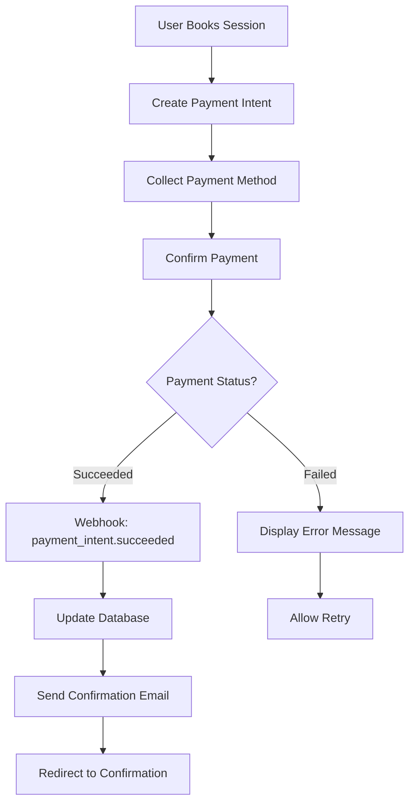

# Stripe Webhook Flows Documentation

## Overview

This document outlines the complete Stripe payment processing and webhook handling flows in the Renavest application, including payment intent processing, subscription management, Connect platform integration, and atomic payment patterns.

## 📋 Table of Contents

1. [Architecture Overview](#architecture-overview)
2. [Payment Processing Flow](#payment-processing-flow)
3. [Webhook Processing](#webhook-processing)
4. [Subscription Management](#subscription-management)
5. [Stripe Connect Integration](#stripe-connect-integration)
6. [Payment Lifecycle Events](#payment-lifecycle-events)
7. [Error Handling & Recovery](#error-handling--recovery)
8. [Security & Compliance](#security--compliance)

## 🏗️ Architecture Overview

### Components
- **Stripe API**: Payment processing and subscription management
- **Stripe Connect**: Therapist payout platform
- **Webhook Handlers**: Process Stripe events to update database
- **Database**: PostgreSQL with payment, session, and subscription tables
- **Next.js API Routes**: Client-server payment communication

### Key Files
```
src/
├── app/api/webhooks/stripe/
│   ├── route.ts                    # Main webhook endpoint
│   └── handlers.ts                 # Event processing logic
├── features/stripe/
│   ├── utils/
│   │   ├── webhook-handlers.ts     # Payment processing logic
│   │   ├── payment-intent.ts       # Payment intent management
│   │   ├── subscription.ts         # Subscription operations
│   │   └── connect.ts              # Stripe Connect operations
│   ├── hooks/
│   │   └── useStripePayment.ts     # Client-side payment hooks
│   └── index.ts                    # Stripe utilities export
└── db/schema/
    ├── sessionPayments.ts          # Payment records
    ├── subscriptions.ts            # Subscription records
    └── therapistPayouts.ts         # Payout tracking
```

## 💳 Payment Processing Flow

### Frontend Payment Process

#### 1. **Session Booking & Payment Intent Creation**
```typescript
// Client initiates session booking
const bookingData = {
  sessionId: string,
  therapistId: string,
  amount: number, // in cents
  currency: 'usd',
  metadata: {
    sessionType: 'therapy_session',
    userId: string,
    therapistId: string,
    platform_fee_amount: number, // 20% platform fee
  }
}

// Create payment intent on server
const paymentIntent = await stripe.paymentIntents.create({
  amount: bookingData.amount,
  currency: bookingData.currency,
  metadata: bookingData.metadata,
  application_fee_amount: bookingData.metadata.platform_fee_amount,
  transfer_data: {
    destination: therapistStripeAccountId,
  },
});
```

#### 2. **Client-Side Payment Collection**
```typescript
// useStripePayment hook handles payment flow
const { confirmPayment, loading, error } = useStripePayment();

const handlePayment = async () => {
  const result = await confirmPayment({
    payment_method: {
      card: elements.getElement(CardElement),
      billing_details: {
        name: user.firstName + ' ' + user.lastName,
        email: user.email,
      },
    },
    return_url: `${window.location.origin}/sessions/confirmation`,
  });

  if (result.error) {
    // Handle payment failure
  } else {
    // Payment succeeded - webhook will handle database updates
    router.push('/sessions/confirmation');
  }
};
```

#### 3. **Payment Confirmation Flow**


### Backend Webhook Processing (Atomic Payments)

#### 1. **Webhook Reception & Verification**
```typescript
// /api/webhooks/stripe - Main endpoint
POST /api/webhooks/stripe
Headers:
  - stripe-signature: [webhook-signature]
Body: StripeEvent

// Verify webhook authenticity
const sig = req.headers['stripe-signature'];
const event = stripe.webhooks.constructEvent(body, sig, webhookSecret);
```

#### 2. **Atomic Payment Processing**

```typescript
export async function handlePaymentIntentSucceeded(
  paymentIntent: Stripe.PaymentIntent,
): Promise<Result<boolean, PaymentError>> {
  
  // STEP 1: Idempotency Check (Critical for webhook retries)
  const existingPayment = await db
    .select()
    .from(sessionPayments)
    .where(eq(sessionPayments.stripePaymentIntentId, paymentIntent.id))
    .limit(1);

  if (existingPayment.length > 0) {
    console.log('Payment already processed, skipping', {
      paymentIntentId: paymentIntent.id,
      existingPaymentId: existingPayment[0].id,
    });
    return ok(true);
  }

  // STEP 2: Atomic Database Transaction
  try {
    const result = await db.transaction(async (tx) => {
      
      // Validate session exists
      const session = await tx
        .select()
        .from(sessions)
        .where(eq(sessions.id, sessionId))
        .limit(1);

      if (!session.length) {
        throw new Error(`Session not found: ${sessionId}`);
      }

      // Create payment record
      const payment = await tx.insert(sessionPayments).values({
        sessionId: sessionId,
        stripePaymentIntentId: paymentIntent.id,
        amount: paymentIntent.amount,
        currency: paymentIntent.currency,
        status: 'succeeded',
        platformFeeAmount: platformFeeAmount,
        therapistPayoutAmount: paymentIntent.amount - platformFeeAmount,
        paymentMethod: paymentIntent.payment_method,
        createdAt: new Date(),
        updatedAt: new Date(),
      }).returning();

      // Update session status
      await tx
        .update(sessions)
        .set({
          status: 'confirmed',
          confirmedAt: new Date(),
          updatedAt: new Date(),
        })
        .where(eq(sessions.id, sessionId));

      return payment[0];
    });

    // STEP 3: Post-Transaction Operations (Non-blocking)
    await Promise.allSettled([
      sendSessionConfirmationEmail(userId, sessionId),
      trackPaymentSucceeded(paymentIntent),
      scheduleTherapistPayout(result.id),
    ]);

    return ok(true);

  } catch (error) {
    console.error('Payment processing failed', {
      paymentIntentId: paymentIntent.id,
      error,
    });
    
    // For critical failures, consider refunding the payment
    // await refundPaymentIntent(paymentIntent.id);
    
    return err({
      type: 'DatabaseError',
      message: 'Failed to process payment',
      originalError: error,
    });
  }
}
```

## 📡 Webhook Processing

### Supported Events

#### Payment Events
```typescript
'payment_intent.succeeded'      // Successful payment
'payment_intent.payment_failed' // Failed payment attempt
'payment_intent.canceled'       // Payment canceled
'payment_intent.requires_action' // 3D Secure or additional auth
```

#### Subscription Events
```typescript
'customer.subscription.created'   // New subscription
'customer.subscription.updated'   // Subscription changes
'customer.subscription.deleted'   // Subscription canceled
'invoice.payment_succeeded'       // Subscription payment success
'invoice.payment_failed'          // Subscription payment failure
```

#### Connect Events
```typescript
'account.updated'                 // Therapist account changes
'transfer.created'                // Payout to therapist
'transfer.failed'                 // Payout failure
'payout.paid'                     // Therapist received funds
```

### Event Processing Pipeline

```typescript
// Main webhook handler
export async function POST(req: NextRequest) {
  // 1. Signature verification
  const event = await verifyStripeWebhook(req);
  
  // 2. Idempotency check
  const processed = await checkEventProcessed(event.id);
  if (processed) return NextResponse.json({ received: true });
  
  // 3. Event routing with atomic processing
  switch (event.type) {
    case 'payment_intent.succeeded':
      return await handlePaymentIntentSucceeded(event.data.object);
    
    case 'payment_intent.payment_failed':
      return await handlePaymentFailed(event.data.object);
    
    case 'customer.subscription.created':
      return await handleSubscriptionCreated(event.data.object);
    
    case 'transfer.created':
      return await handleTherapistPayout(event.data.object);
    
    default:
      console.log('Unhandled event type:', event.type);
      return NextResponse.json({ received: true });
  }
}
```

## 🔄 Subscription Management

### Subscription Lifecycle

#### 1. **Subscription Creation**
```typescript
// Create subscription for premium features
export async function createSubscription(
  customerId: string,
  priceId: string,
  userId: string,
): Promise<Stripe.Subscription> {
  
  const subscription = await stripe.subscriptions.create({
    customer: customerId,
    items: [{ price: priceId }],
    payment_behavior: 'default_incomplete',
    payment_settings: { save_default_payment_method: 'on_subscription' },
    expand: ['latest_invoice.payment_intent'],
    metadata: {
      userId: userId,
      subscriptionType: 'premium_therapy',
    },
  });

  // Store subscription in database
  await db.insert(subscriptions).values({
    userId: userId,
    stripeSubscriptionId: subscription.id,
    stripeCustomerId: customerId,
    status: subscription.status,
    currentPeriodStart: new Date(subscription.current_period_start * 1000),
    currentPeriodEnd: new Date(subscription.current_period_end * 1000),
    createdAt: new Date(),
  });

  return subscription;
}
```

#### 2. **Subscription Updates**
```typescript
export async function handleSubscriptionUpdated(
  subscription: Stripe.Subscription,
): Promise<Result<boolean, SubscriptionError>> {
  
  try {
    await db.transaction(async (tx) => {
      await tx
        .update(subscriptions)
        .set({
          status: subscription.status,
          currentPeriodStart: new Date(subscription.current_period_start * 1000),
          currentPeriodEnd: new Date(subscription.current_period_end * 1000),
          cancelAtPeriodEnd: subscription.cancel_at_period_end,
          updatedAt: new Date(),
        })
        .where(eq(subscriptions.stripeSubscriptionId, subscription.id));

      // Handle status changes
      if (subscription.status === 'active') {
        await activatePremiumFeatures(subscription.metadata.userId);
      } else if (subscription.status === 'canceled') {
        await deactivatePremiumFeatures(subscription.metadata.userId);
      }
    });

    return ok(true);
  } catch (error) {
    return err({
      type: 'DatabaseError',
      message: 'Failed to update subscription',
      originalError: error,
    });
  }
}
```

## 🔗 Stripe Connect Integration

### Therapist Onboarding

#### 1. **Connect Account Creation**
```typescript
export async function createTherapistConnectAccount(
  therapistId: string,
  email: string,
): Promise<string> {
  
  const account = await stripe.accounts.create({
    type: 'express',
    country: 'US',
    email: email,
    capabilities: {
      card_payments: { requested: true },
      transfers: { requested: true },
    },
    business_type: 'individual',
    metadata: {
      therapistId: therapistId,
      platform: 'renavest',
    },
  });

  // Store Connect account ID
  await db
    .update(therapists)
    .set({
      stripeConnectAccountId: account.id,
      stripeAccountStatus: 'pending',
      updatedAt: new Date(),
    })
    .where(eq(therapists.id, therapistId));

  return account.id;
}
```

#### 2. **Onboarding Link Generation**
```typescript
export async function createOnboardingLink(
  accountId: string,
): Promise<string> {
  
  const accountLink = await stripe.accountLinks.create({
    account: accountId,
    refresh_url: `${process.env.NEXT_PUBLIC_APP_URL}/therapist/stripe/refresh`,
    return_url: `${process.env.NEXT_PUBLIC_APP_URL}/therapist/stripe/complete`,
    type: 'account_onboarding',
  });

  return accountLink.url;
}
```

### Payout Processing

#### 1. **Automatic Payouts**
```typescript
export async function handleTransferCreated(
  transfer: Stripe.Transfer,
): Promise<Result<boolean, PayoutError>> {
  
  try {
    await db.transaction(async (tx) => {
      // Find the payment this transfer relates to
      const payment = await tx
        .select()
        .from(sessionPayments)
        .where(eq(sessionPayments.stripePaymentIntentId, transfer.source_transaction))
        .limit(1);

      if (!payment.length) {
        throw new Error(`Payment not found for transfer: ${transfer.id}`);
      }

      // Record the payout
      await tx.insert(therapistPayouts).values({
        therapistId: payment[0].therapistId,
        sessionPaymentId: payment[0].id,
        stripeTransferId: transfer.id,
        amount: transfer.amount,
        currency: transfer.currency,
        status: 'pending',
        createdAt: new Date(),
      });

      // Update payment status
      await tx
        .update(sessionPayments)
        .set({
          payoutStatus: 'transferred',
          payoutInitiatedAt: new Date(),
        })
        .where(eq(sessionPayments.id, payment[0].id));
    });

    return ok(true);
  } catch (error) {
    return err({
      type: 'DatabaseError',
      message: 'Failed to process payout',
      originalError: error,
    });
  }
}
```

## 🛠️ Error Handling & Recovery

### Payment Failure Recovery

#### 1. **Failed Payment Processing**
```typescript
export async function handlePaymentFailed(
  paymentIntent: Stripe.PaymentIntent,
): Promise<Result<boolean, PaymentError>> {
  
  try {
    await db.transaction(async (tx) => {
      // Find the session
      const sessionId = paymentIntent.metadata.sessionId;
      
      // Update session status
      await tx
        .update(sessions)
        .set({
          status: 'payment_failed',
          updatedAt: new Date(),
        })
        .where(eq(sessions.id, sessionId));

      // Create failed payment record for tracking
      await tx.insert(sessionPayments).values({
        sessionId: sessionId,
        stripePaymentIntentId: paymentIntent.id,
        amount: paymentIntent.amount,
        currency: paymentIntent.currency,
        status: 'failed',
        failureReason: paymentIntent.last_payment_error?.message,
        createdAt: new Date(),
      });
    });

    // Send failure notification
    await sendPaymentFailureNotification(
      paymentIntent.metadata.userId,
      sessionId,
      paymentIntent.last_payment_error?.message,
    );

    return ok(true);
  } catch (error) {
    return err({
      type: 'DatabaseError',
      message: 'Failed to process payment failure',
      originalError: error,
    });
  }
}
```

### Webhook Retry Logic
- **Success (200):** Stripe stops retrying
- **Temporary Error (5xx):** Stripe retries with exponential backoff for 3 days
- **Client Error (4xx):** Stripe stops retrying immediately
- **Timeout:** Stripe retries up to 3 times

### Idempotency Implementation
```typescript
// Critical: Prevent duplicate processing during retries
export async function checkEventProcessed(eventId: string): Promise<boolean> {
  const processed = await db
    .select()
    .from(stripeEvents)
    .where(eq(stripeEvents.eventId, eventId))
    .limit(1);

  return processed.length > 0;
}

export async function markEventProcessed(eventId: string): Promise<void> {
  await db.insert(stripeEvents).values({
    eventId: eventId,
    processedAt: new Date(),
  }).onConflictDoNothing();
}
```

## 🔒 Security & Compliance

### Webhook Security
1. **Signature Verification:** HMAC-SHA256 with Stripe webhook secret
2. **Timestamp Validation:** Prevent replay attacks (5-minute window)
3. **IP Allowlisting:** Stripe's webhook IPs only
4. **Rate Limiting:** Built into Stripe's retry mechanism

### PCI Compliance
1. **No Card Data Storage:** All payment data handled by Stripe
2. **Tokenization:** Payment methods stored as Stripe tokens only
3. **Secure Transmission:** HTTPS for all payment-related communication
4. **Audit Logging:** Comprehensive payment operation tracking

### Data Protection
```typescript
// Sensitive data handling
const sanitizedPaymentIntent = {
  id: paymentIntent.id,
  amount: paymentIntent.amount,
  currency: paymentIntent.currency,
  status: paymentIntent.status,
  // Never log: payment_method, customer details, card info
};

console.log('Processing payment', sanitizedPaymentIntent);
```

## 📊 Monitoring & Analytics

### Key Metrics
- **Payment Success Rate:** Track successful vs failed payments
- **Webhook Processing Time:** Monitor performance
- **Payout Timing:** Track therapist payment delivery
- **Subscription Churn:** Monitor subscription cancellations

### Event Tracking
```typescript
// PostHog integration for payment analytics
trackPaymentSucceeded({
  paymentIntentId: paymentIntent.id,
  amount: paymentIntent.amount,
  therapistId: metadata.therapistId,
  sessionType: metadata.sessionType,
  processingTime: endTime - startTime,
});
```

## 🔄 Integration Points

### Clerk Integration
- **Customer Creation:** Link Stripe customers to Clerk users
- **Subscription Access:** Role-based premium feature access
- **Payment Authentication:** User validation for transactions

### Database Integration
- **Payment Records:** Comprehensive payment tracking
- **Session Management:** Link payments to therapy sessions
- **Audit Trails:** Complete financial operation logging

### Email Integration
- **Payment Confirmations:** Automated receipt delivery
- **Subscription Updates:** Billing notification emails
- **Failure Notifications:** Payment failure alerts

---

**Last Updated:** July 2025  
**Version:** 1.0  
**Next Review:** After major Stripe version updates or significant flow changes